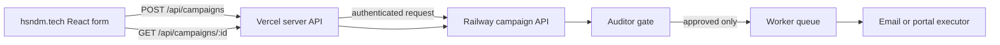

# AutoApply SA — Railway, Frontend, and Local Test Setup

## First: What Exists Today

The Railway service currently exposes only these routes:

| Route | Current purpose | Do not connect the public frontend to it directly |
| --- | --- | --- |
| `GET /status` | Health and aggregate engine metrics | Safe for manual operational checks. |
| `POST /run` | Starts a legacy application cycle using server-side defaults | **Do not expose to visitors.** It is not a campaign API. |
| `POST /kill` / `POST /resume` | Stops or resumes the legacy worker | Owner operation only. |

The website at `https://hsndm.tech` currently keeps CV selection in the browser and links to WhatsApp. It does **not** upload a CV, create a campaign, or query campaign status from Railway. A proper frontend connection therefore needs a new authenticated campaign API; do not wire the website directly to `/run`.

## 1. Set up the Railway Service

### 1.1 Deploy the repository

In Railway, create or open the project that should run AutoApply SA. Create a service from the GitHub repository `hsndm566/autoapply-sa` and deploy the `main` branch. The repository's `railway.json` starts `service.py` and checks `/status`.

Generate a public domain for the service in Railway. Record it as:

```text
https://YOUR-RAILWAY-SERVICE.up.railway.app
```

After every change to variables, use Railway's staged-changes review and deploy action. Variables are applied to the build and running service only after deployment.

### 1.2 Add persistent storage

The current backend uses SQLite and needs a persistent CV file. Create one Railway volume attached to the backend service and mount it at:

```text
/data/autoapply
```

The mount gives the running service a durable directory. It must contain both the database and the real CV artifact:

```text
/data/autoapply/autoapply.db
/data/autoapply/cv/candidate-cv.pdf
```

Upload the CV into the volume using the Railway CLI from your own computer:

```bash
railway login
railway link
railway volume files upload ./candidate-cv.pdf /cv/candidate-cv.pdf
```

The volume file path `/cv/candidate-cv.pdf` appears inside the running backend as `/data/autoapply/cv/candidate-cv.pdf` because the volume is mounted at `/data/autoapply`.

### 1.3 Configure Railway Variables

In the backend service, open **Variables** and use the Raw Editor to enter the values below. The repository contains `.env.example` as a key-only reference; do not upload a filled secret file to GitHub.

```dotenv
# Durable state and the CV artifact on the mounted Railway volume
DB_PATH=/data/autoapply/autoapply.db
CV_PATH=/data/autoapply/cv/candidate-cv.pdf

# Current legacy engine inputs — use factual content only
CV_TEXT=Your concise factual career summary
CANDIDATE_FULL_NAME=Your real name
CANDIDATE_EMAIL=your-email@example.com
APPLY_NAME=Your real name
APPLY_ROLE=business systems analyst

# Required independent Auditor
AUDITOR_PROVIDER=deepseek
AUDITOR_MODEL=deepseek-chat
DEEPSEEK_API_KEY=YOUR_VALUE

# Current drafting and discovery integrations
GROQ_API_KEY=YOUR_VALUE
APIFY_API_KEY=YOUR_VALUE

# Optional notifications
TELEGRAM_BOT_TOKEN=YOUR_VALUE
TELEGRAM_ALLOWED_USERS=YOUR_TELEGRAM_CHAT_ID
```

Do **not** set Browserbase values to make portal applications live yet. The Auditor intentionally rejects portal work until the browser executor supports and verifies a real `input[type=file]` CV upload. Do **not** re-enable the former Gmail self-preview behavior; an audited employer-email dispatcher must be built separately.

Check that Railway is healthy after deployment:

```bash
curl -s https://YOUR-RAILWAY-SERVICE.up.railway.app/status
```

Expected result: JSON containing `"ok": true` and `"engine": "orchestrator"`.

## 2. Connect `hsndm.tech` Correctly

### Recommended shape: website → Vercel API proxy → Railway campaign API

Do not put any secret in React code or in a `VITE_*` variable; browsers reveal those values to every visitor. The frontend should call a same-domain Vercel API route, and that route should call Railway using a server-only token.



The existing `service.py` is not yet a campaign API. The next backend change must add these routes before altering the public React form:

| Required route | Responsibility |
| --- | --- |
| `POST /v1/campaigns` | Receive an explicit campaign brief and CV upload; store the file on the volume; create a campaign ID; return `202 Accepted`. It must not submit any jobs immediately. |
| `GET /v1/campaigns/{campaign_id}` | Return truthful campaign/job/audit status for the dashboard. |
| `POST /v1/campaigns/{campaign_id}/start` | Require the user's explicit start action; enqueue discovery/drafting only. The Auditor remains mandatory before dispatch. |
| `POST /v1/campaigns/{campaign_id}/pause` | Stop future work without deleting the audit trail. |

After those routes exist, configure two server-only Vercel variables:

```dotenv
RAILWAY_API_BASE_URL=https://YOUR-RAILWAY-SERVICE.up.railway.app
RAILWAY_INTERNAL_TOKEN=the-same-long-random-value-as-Railway
```

Configure the same value in Railway as `INTERNAL_SERVICE_TOKEN`. The future Railway campaign API must verify that token on every Vercel-to-Railway request. Never prefix either Vercel value with `VITE_`.

The React form should then:

1. Send its CV file and target preferences to `/api/campaigns`.
2. Receive a `campaign_id` from the Vercel proxy.
3. Redirect to a campaign status view.
4. Poll `GET /api/campaigns/{campaign_id}` for status.
5. Display **drafting**, **audit rejected**, **audit approved**, **queued**, **submitted**, or **failed** exactly as returned by Railway.

Until the campaign API exists, keep the live website's current WhatsApp handoff. Do not point the public form at `/run`.

## 3. Run a Safe Local End-to-End Test

Pull the latest repository, then run:

```bash
git pull origin main
python3 smoke_test_audited_pipeline.py
python3 -m unittest -v test_auditor.py
```

The smoke test is deliberately safe. It makes a temporary CV and SQLite database, simulates an approved tailored email package, verifies that the generated email contains the CV attachment, and verifies that the current portal path is rejected for missing verified file upload. It never calls Railway, an LLM provider, Gmail, Browserbase, a job site, or a real browser.

Expected output includes:

```text
PASS 1: Auditor approved a complete, personalized email package.
PASS 2: Dispatcher received an approved email with a real CV attachment.
SAFE: No SMTP connection was opened and no email was sent.
PASS 3: Auditor blocked portal execution without verified CV upload.
```

## 4. Deployment Order

1. Run the two local commands above and require a clean pass.
2. Create the Railway volume and upload the CV.
3. Add Railway variables and deploy.
4. Verify `GET /status`.
5. Build the authenticated campaign API and Vercel proxy.
6. Connect the React campaign form to the proxy.
7. Add a `dry_run` campaign test that produces a dashboard record but no third-party action.
8. Implement verified portal CV upload before permitting any live portal submission.

## References

[1] [Railway Variables documentation](https://docs.railway.com/variables)

[2] [Railway Volumes documentation](https://docs.railway.com/volumes)

[3] [Railway variable reference](https://docs.railway.com/variables/reference)
