# AutoApply SA — Stack Enhancement Plan

## Executive Priority

The highest-value work is not adding more AI models or more browser automation. It is making every campaign **durable, observable, source-diverse, and truthfully measurable**. The existing Auditor is the guardrail; the next enhancements make the system capable of operating continuously without losing work or overstating results.

> **Architecture principle:** A browser click, an email attempt, or an AI response is not a business outcome. The database must record intent, evidence, and final status around every external action.

## Current Architecture Risks

| Current condition | Why it limits the product | Required correction |
| --- | --- | --- |
| Web service contains the scheduler and the worker | A restart can interrupt a cycle; API availability and background work are coupled. | Split API, scheduler, and worker responsibilities. |
| SQLite sits on the service filesystem/volume | It is acceptable for a small single-worker prototype but limits concurrent workers and makes deployments with a mounted volume less flexible. | Keep it temporarily; plan a move to managed PostgreSQL before multi-worker production. |
| `/run`, `/kill`, and `/resume` are legacy owner controls | They are not campaign APIs and cannot safely serve public frontend traffic. | Build authenticated campaign endpoints and retire public use of legacy controls. |
| Application table stores a narrow status | It cannot explain the whole campaign, source state, CV version, audit evidence, submit proof, or outreach result. | Add campaign, job, attempt, audit, evidence, and outbox records. |
| In-process scheduler runs once daily | It cannot guarantee missed runs are visible, and it shares lifecycle with the web API. | Use a short-lived scheduled worker and a run ledger/heartbeat. |
| Browser outcome can be ambiguous | A click or timeout can be mistaken for success. | Persist explicit post-submit evidence and separate `submitted_verified` from `attempted`. |

## Target Operating Model

```mermaid
flowchart LR
    UI[hsndm.tech campaign form] --> API[Campaign API]
    API --> DB[(Campaign database)]
    DB --> Outbox[Durable outbox]
    Outbox --> Worker[Source + application worker]
    Worker --> Sources[Employer ATS boards]
    Sources --> Verify[Path Verifier]
    Verify --> Draft[Drafting worker]
    Draft --> Audit[Auditor gate]
    Audit -->|approved only| Dispatch[Email / portal dispatcher]
    Dispatch --> Evidence[Submission evidence]
    Evidence --> DB
    DB --> API
    API --> UI
```



The frontend creates a campaign, not a browser job. The database creates durable work records, not in-memory threads. The worker performs one bounded step at a time. The Auditor remains the gate directly before each external side effect.

## Build Backlog

### P0 — Must Build Before Scaling Sources

| Enhancement | Value | Acceptance test |
| --- | --- | --- |
| Campaign data model | Gives every candidate/CV/role set a durable campaign ID and lifecycle. | A campaign can be created, paused, resumed, and viewed without using `/run`. |
| Source registry | Replaces the hard-coded repeat-company loop with a reusable employer-board inventory. | A source refresh uses registry entries and honors employer/source caps. |
| Job and attempt records | Separates a job posting from each candidate’s application attempt. | One job can be matched to many campaigns without duplicate submissions by one candidate. |
| Path Verifier | Stops AI/browser spend on unusable paths. | Jobs are classified as direct email, verified upload, complex, blocked, or expired. |
| Submission evidence table | Makes portal success provable. | A `submitted_verified` record includes timestamp, final URL, confirmation excerpt, source, and CV hash. |
| Feature flags by source | Prevents a new adapter from affecting all campaigns. | A source remains dry-run-only until its live E2E test is explicitly enabled. |

### P1 — Reliability and Cloud Operations

| Enhancement | Value | Design choice |
| --- | --- | --- |
| Database-backed outbox | Prevents the “DB said queued but worker never ran” failure. | Write the campaign/job state and outbox event in one transaction; a worker drains the outbox. |
| Idempotency keys | Prevents duplicate email/portal attempts after a retry or restart. | Key = candidate + job posting + CV hash + action type. |
| Dedicated worker process | Keeps browser/source work away from the HTTP API process. | One low-concurrency worker initially; never run concurrent sessions for the same candidate. |
| Native scheduled runs | Makes periodic source refreshes short-lived and observable. | Use a dedicated scheduled process that exits when complete, not an in-process scheduler inside the API server. |
| Run ledger and heartbeat | Shows whether an expected run actually started, finished, or stalled. | Store `run_id`, start/end, count, error summary, and last successful heartbeat. |
| Source health canaries | Detects upstream API/form changes before they affect candidates. | Run read-only tests for each adapter; mark degradation rather than guessing. |
| Structured logs | Makes “it failed” diagnosable. | Include campaign ID, job ID, source, stage, action ID, retry count, and audit token fingerprint. |

A transactional outbox is appropriate because a campaign update and the request to process it must not become inconsistent if one succeeds while the other fails. Consumers must still be idempotent because queue-like systems can deliver work more than once.[1]

### P2 — Product and Conversion

| Enhancement | Value | User-visible result |
| --- | --- | --- |
| Campaign API and Vercel proxy | Turns `hsndm.tech` into a real intake and dashboard. | Candidate uploads CV, picks role/city/language, and receives a campaign ID. |
| CV versioning | Stops the wrong CV from being used after a candidate uploads a replacement. | Every attempt shows the exact CV hash and version used. |
| Campaign status timeline | Builds trust and reduces WhatsApp follow-up. | “12 matched, 8 paths verified, 5 audited, 1 submitted, 4 blocked.” |
| Outreach lane | Treats 417/500 verified contacts as a measurable channel, not fake applications. | Delivery, bounce, reply, and opt-out are separate from portal applications. |
| Follow-up policy engine | Creates value after initial applications. | Follow-up is scheduled only where an employer/contact and campaign policy permit it. |
| Outcome learning | Lets the product improve by source, role, and template. | Reports response rate and blocker rate by source and campaign—not invented AI confidence. |

### P3 — Scale Only When the Evidence Requires It

| Trigger | Upgrade |
| --- | --- |
| More than one worker, frequent deployments, or growing campaign volume | Move campaign/application state from SQLite to PostgreSQL. |
| Multiple CV files and many candidate artifacts | Use object storage for CVs and evidence; store only URI + hash in the database. Azure Blob is a natural fit if you want to use existing Azure credit. |
| Browser execution becomes a bottleneck | Deploy a separate low-concurrency browser-worker service with per-source and per-candidate quotas. |
| Source refresh takes too long | Partition refreshes by source/campaign, retain source pacing, and use queue-depth metrics. |
| Workflow becomes complex with human pauses/approvals | Evaluate a durable workflow engine. Do not introduce one merely because it is fashionable. |

## What Not to Build Yet

Do not add Redis, Kafka, Temporal, a second browser cluster, another LLM, or an Azure/Oracle migration before P0 and P1 are working. The system currently needs truthfulness and durability more than infrastructure complexity.

Do not add any source that relies on CAPTCHA bypass, credential sharing, or undocumented private application APIs. Such sources should be classified as `blocked` or `needs_review` until a legitimate candidate path exists.

## Technical Completion Definition

A production-ready campaign flow is complete only when all conditions are true:

1. `POST /v1/campaigns` creates a database-backed campaign with a CV version and candidate profile.
2. The source registry produces normalized, deduplicated jobs across multiple ATS families.
3. Every job has a path-verifier classification before drafting.
4. Every external action has an idempotency key, a durable intent record, and Auditor approval.
5. Every portal success has post-submit proof; every email success has the actual recipient and attachment evidence.
6. The dashboard reports truthful counts for discovered, matched, verified, audited, attempted, submitted, failed, and blocked records.
7. A scheduled source run and a worker failure both create visible run/evidence records.
8. A deployment cannot silently remove or weaken the Auditor test suite.

## Hermes Implementation Order

### Sprint 1 — Data and Read-Only Operation

1. Read `AGENT_GOVERNANCE.md`, `MULTI_SOURCE_INTEGRATION_PLAN.md`, and this document.
2. Create campaign, source registry, job, application-attempt, evidence, and run-ledger tables.
3. Implement Greenhouse/Lever/Ashby read-only ingestion into the shared job schema.
4. Add path-verifier statuses and diversity caps.
5. Create unit tests and source canaries. Do not submit applications.

### Sprint 2 — Durable Processing

1. Add an outbox table and idempotent worker claims.
2. Split the API process from the scheduled source runner/worker.
3. Add structured logging and source/run metrics.
4. Implement authenticated campaign API endpoints.
5. Keep portal and employer-email dispatch disabled except for existing audited tests.

### Sprint 3 — One Controlled Execution Source

1. Implement verified Greenhouse hosted-form CV upload.
2. Add a source-specific E2E test using a controlled safe fixture or explicitly authorized test posting.
3. Capture post-submit evidence.
4. Enable the source through a feature flag for one controlled campaign.
5. Review the evidence before enabling another source.

## Required Hermes Response Before Coding

```text
I have read STACK_ENHANCEMENT_PLAN.md, MULTI_SOURCE_INTEGRATION_PLAN.md,
AGENT_GOVERNANCE.md, and AUDITOR_SYSTEM_PROMPT.md.

I will implement Sprint 1 only: data model, registry, normalized read-only
source ingestion, path verification, diversity caps, tests, and canaries.

I will not deploy, email, submit, weaken the Auditor, enable a source, or add
browser execution until Sprint 1 is tested and reported.
```

## References

[1] [AWS Prescriptive Guidance — Transactional outbox pattern](https://docs.aws.amazon.com/prescriptive-guidance/latest/cloud-design-patterns/transactional-outbox.html)

[2] [Railway Cron Jobs](https://docs.railway.com/cron-jobs)

[3] [Railway Healthchecks](https://docs.railway.com/deployments/healthchecks)

[4] [Temporal — Reliable data processing: queues and workflows](https://temporal.io/blog/reliable-data-processing-queues-workflows)
